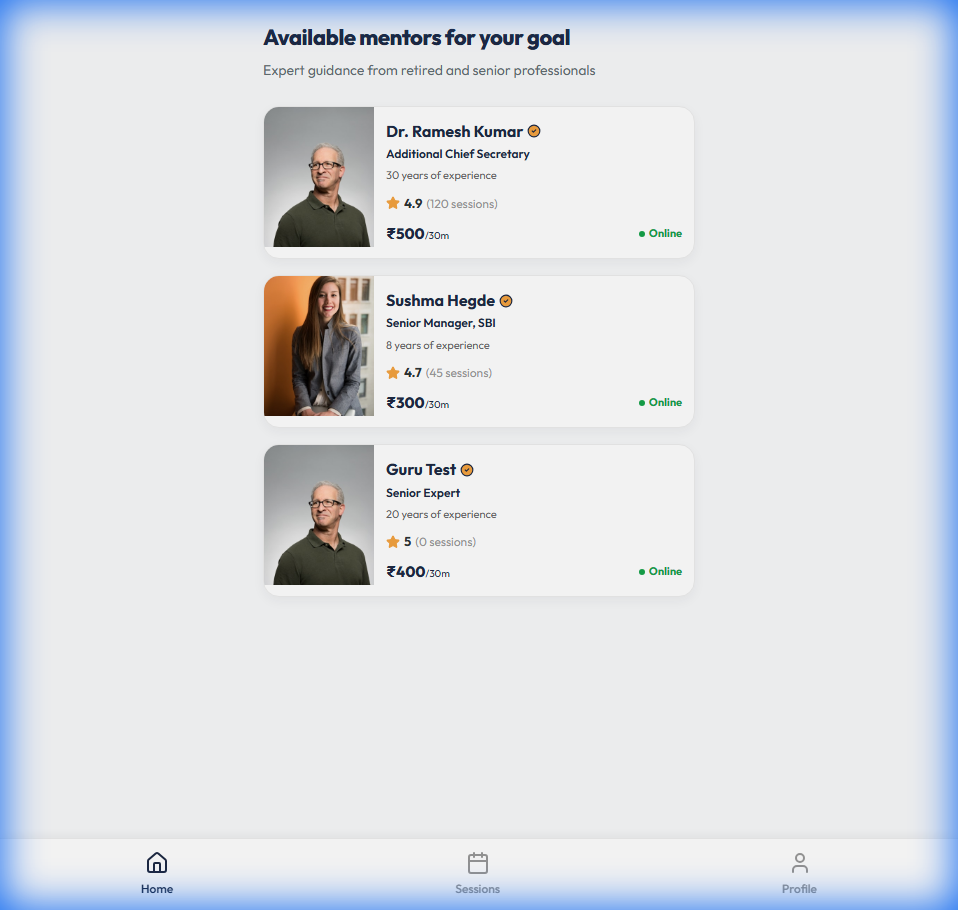
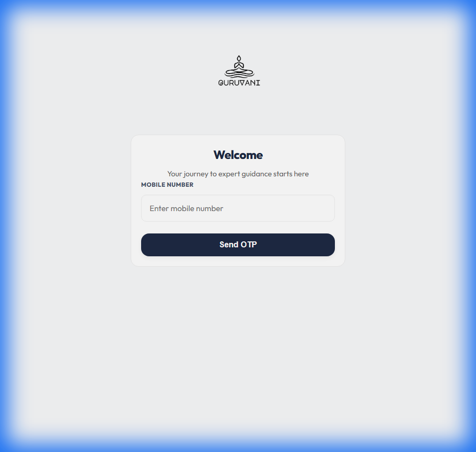
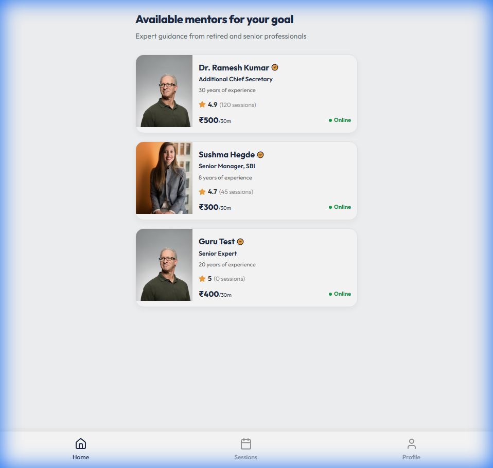

# 🕉️ GuruVani - Real Voices, Real Guidance

.PNG)

**GuruVani** is a premium mentorship platform designed for the Indian education and career landscape. It connects aspiring students and professionals with retired or senior industry experts who provide high-quality, trustworthy guidance through secure audio and video consultations.

## ✨ Features

- **🇮🇳 Full Indian Identity**: Localized pricing specifically in Indian Rupees (₹) and a curated aesthetic tailored for Indian users.
- **🛡️ Elite Mentor Selection**: A rigorous onboarding process requiring a minimum of 15 years of industry experience.
- **📄 Secure Document Verification**: Functional document upload flow for Identity and Professional proof.
- **⚡ Real-time Persistence**: Dynamic session booking and admin approval flows that work instantly (powered by persistent local state).
- **📱 Mobile-First Design**: Premium UI/UX optimized for high-end mobile experiences using modern typography and glassmorphism.
- **🖥️ Admin & Mentor Dashboards**: Comprehensive management consoles for platform oversight and session management.

## 📸 Presentation Preview

| Splash Screen | Login Flow | Mentor List |
| :---: | :---: | :---: |
|  |  |  |

| Mentor Profile | Student Dashboard |
| :---: | :---: |
|  |  |

## 🛠️ Tech Stack

- **Frontend**: React.js with Vite
- **Styling**: Vanilla CSS with a customized Design System
- **Icons**: Lucide React
- **State Management**: React Context API
- **Persistence**: LocalStorage (Real-time Simulation)

## 🚀 Getting Started

### Prerequisites

- Node.js (v16+)
- npm or yarn

### Installation

1. **Clone the repository**
   ```bash
   git clone https://github.com/PallaviJadar/GuruVani.git
   cd GuruVani
   ```

2. **Install dependencies**
   ```bash
   npm install
   ```

3. **Run the development server**
   ```bash
   npm run dev
   ```

## 🌟 Demo Credentials (MVP Only)

- **Mobile Number**: Any 10-digit number
- **OTP**: `1234`
- **Management Console**: Accessible via the `Profile` page to switch between **Student**, **Mentor**, and **Admin** views instantly.

## 📄 License

This project is developed for MVP/Presentation purposes. All rights reserved.

---
*Created with ❤️ for GuruVani by PJ.*
